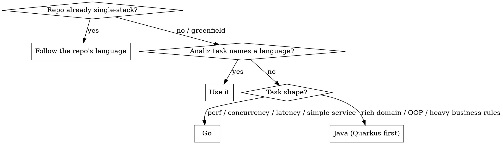

# Java vs Go Decision

## Overview

You write both Go and Java. The wrong choice is not a style preference — it fights the grain of the problem and the repository for the life of the code. Decide deliberately, at the start of the task, before writing anything.

**Core principle:** The repository's existing language wins by default. Only greenfield services or the analiz task's explicit direction open the choice.

## The Decision

## Choose Go when

- The task is performance-, throughput-, latency-, or concurrency-sensitive (high-QPS API, streaming, fan-out, background workers).
- The service is small and mostly I/O plumbing over a datastore.
- The repository is already Go — always.

## Choose Java when

- The domain is rich: many entities, invariants, and business rules that benefit from OOP modelling and a mature type/framework ecosystem.
- The repository is already Java — always.
- The analiz task specifies Java.

**Within Java: Quarkus first.** Reach for Spring Boot only when Quarkus does not fit (a required library has no Quarkus extension, the team/repo standard is Spring, or the deployment target expects a Spring app). See quarkus-service-architecture and spring-boot-fallback.

## Hard Rule

Never introduce a second language into a single-stack repository. If a Go repo needs a capability that "would be nicer in Java," that is a signal for the architect's analysis, not a unilateral stack addition — flag it in a task comment, don't create a polyglot repo on your own.

## Common Mistakes

- Picking your favourite language instead of the repo's.
- Choosing Java for a thin CRUD proxy (Go is faster to write and run there).
- Choosing Go for a domain with dozens of interacting business rules (you will hand-roll what a Java framework gives you).
- Adding a Java module to a Go repo because one endpoint felt object-oriented.

## Red Flags

- You are about to `go mod init` inside a repo full of `pom.xml` (or vice versa).
- Your language choice has no reason beyond preference.
