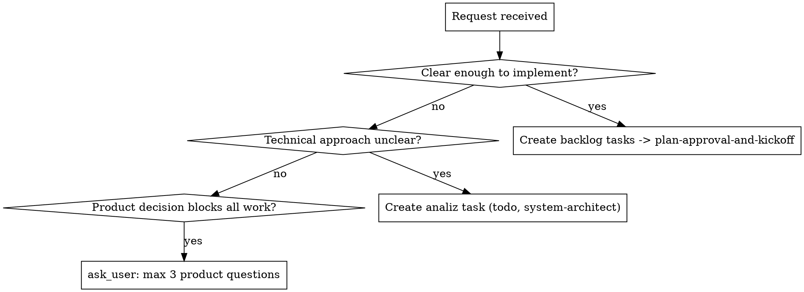

# Stakeholder Intake

## Overview

A stakeholder request is raw intent. Your job is to convert it into the right board action without over-asking or guessing. The two failure modes are asking questions the request already answers (or that the code/architect could answer) and creating implementation tasks before the approach is understood.

**Core principle:** Extract intent, then route: backlog tasks (clear), an analiz task (approach unclear), or one focused product question (a decision blocks everything).

## Routing

## Steps

1. **Extract:** product goal, affected users, constraints, urgency.
2. **Route** per the diagram. Analiz tasks go straight to `todo` (investigation is always safe — no approval needed). The analiz itself will come back through the human `analiz_review` gate before any implementation task is created.
3. **Never post question lists in chat** — use `ask_user` or board tasks.
4. After clarification, **act immediately**; do not re-ask the same topic.

## Worked Example

Request: "We need reporting." Vague — don't create tasks. But is it a product or a technical unknown? The *scope* of "reporting" is a product decision → `ask_user`: "Which one report unblocks you first: (a) tasks-per-project, (b) throughput over time, (c) per-assignee load?" Once they pick (a), the *how* (query? materialized view?) is a technical unknown → create an analiz task for the architect, not more stakeholder questions.

## Common Mistakes

- Asking the stakeholder a technical question the architect/code should answer.
- Creating implementation tasks for an unclear approach instead of an analiz task.
- Question lists in chat instead of `ask_user`.
- Re-asking something already answered.

## Red Flags

- More than 3 questions, or any non-product (technical) question to the stakeholder.
- Implementation tasks created before the approach is understood.
