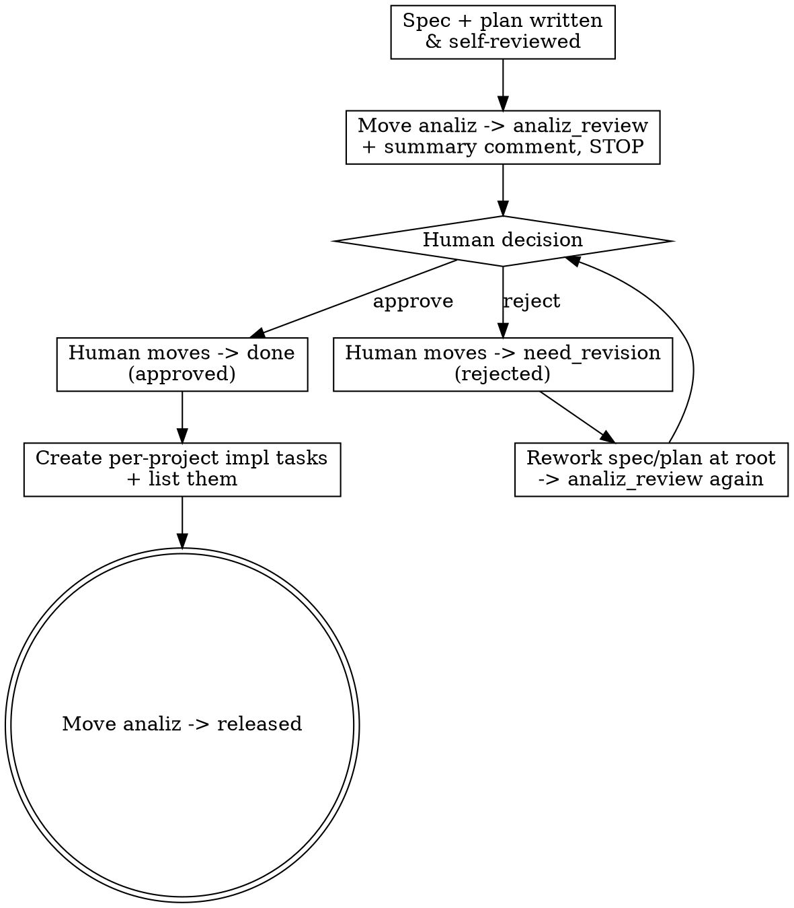

# Analiz Human Review Gate

## Overview

Your analysis output — the spec and the implementation plan — is not self-approved. A human reviews it BEFORE any implementation task exists. This is the only human gate in the system: the human does not review individual dev tasks, but they DO review your plan, because a wrong plan multiplies into wrong tasks across every project.

**Core principle:** No implementation task is created from an unapproved plan. You stop at `analiz_review` and wait.

**This reverses the old flow.** You no longer create tasks and then close the analiz. You present the plan, wait for approval, and only THEN create tasks.

## The Gate

## Step 1 — Present for review (do NOT create tasks yet)

When the spec and plan are written, self-reviewed, and attached via add_task_document:

1. `move_board_task` the analiz task to **analiz_review**.
2. `add_task_comment` — a review-ready summary for the human:
   - One-paragraph approach (what will be built and why this approach).
   - The titles of the two documents you attached (`spec: …`, `plan: …`).
   - **The project/task split you INTEND to create** on approval — list each project and the one-line scope of its task (see project-split-decomposition). This is what the human is approving.
   - Any product decision you need confirmed.
3. **STOP.** Your run ends here. Create nothing. Do not touch implementation tasks.

## Step 2 — Handle the human's decision

You are re-dispatched (as the analiz task's assignee) when the human moves the task. The task's current column tells you which path:

**Column is `done` → APPROVED.**
1. Now create the per-project implementation tasks (project-split-decomposition + task-decomposition).
2. Every one of them carries `derived_from: ["<this analiz task's key>"]`. Your spec and plan are documents on THIS task and exist nowhere else — the reference is what puts them in front of the developer and what makes `list_task_documents` able to return them. A task without it is a task whose specification cannot be found.
3. Every ordering between them goes in `blocked_by` (who codes first) and `deploy_depends_on` (who ships first), not in the description.
4. `add_task_comment` listing every created task: title, assignee, project, and its order.
5. `move_board_task` the analiz task to **released**. You are finished.

**Column is `need_revision` → REJECTED.**
1. Read the human's comment completely — it says what to change.
2. Revise the spec and/or plan at the root of the concern (see root-cause-review reasoning — fix the cause, not the wording).
3. Re-run the spec and plan self-reviews.
4. `move_board_task` back to **analiz_review** with a comment stating exactly what changed.
5. **Create no implementation tasks.** A rejected analysis never spawns work.

## Common Mistakes

- Creating implementation tasks before approval — the whole point of the gate is that tasks come AFTER the human says yes.
- Moving the analiz task straight to `done` yourself — `done` is the human's approval action, not yours. You move it to `analiz_review` and to `released`; the human moves it to `done` or `need_revision`.
- On rejection, tweaking wording instead of addressing the concern — the human will reject again.
- Forgetting to list the intended project/task split in the review comment — the human is approving the split, so show it.

## Red Flags — STOP

- You are about to call create_board_task and the analiz task is still in `analiz_review` → you are creating tasks before approval.
- You created implementation tasks without `derived_from` → they point at no analysis, and the spec you spent the run writing is unreachable from the work it specifies.
- You moved the analiz task to `done` → that is the human's move, not yours.
- A revision came back and you are editing task titles instead of the spec → you are patching symptoms.
