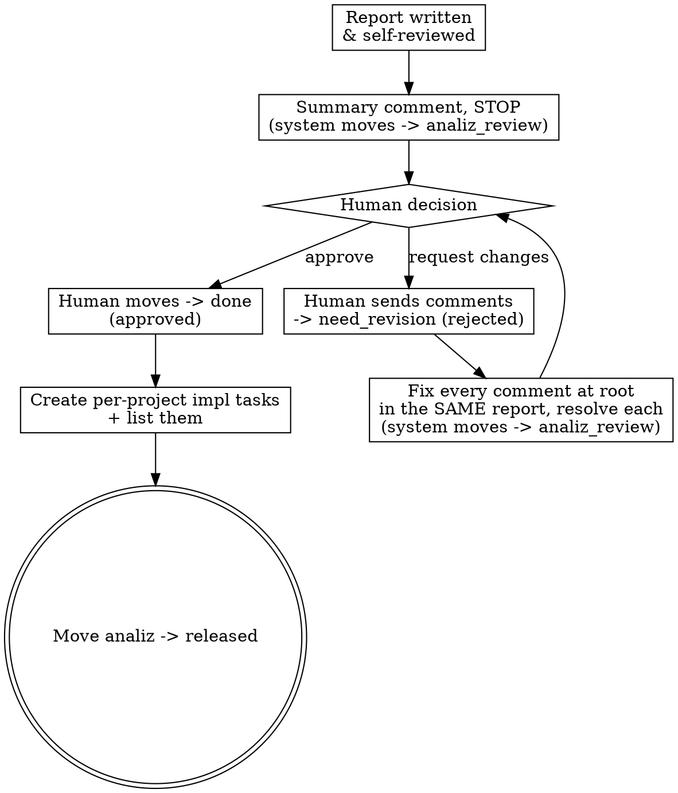

# Analiz Human Review Gate

## Overview

Your analysis output — the ONE analysis report, with the spec and the implementation plan as its sections — is not self-approved. A human reviews it BEFORE any implementation task exists. This is the only human gate in the system: the human does not review individual dev tasks, but they DO review your plan, because a wrong plan multiplies into wrong tasks across every project.

The human reviews the report passage by passage: they select text in it, comment on it, and send all their comments back at once. Each comment is anchored to the words it is about, so it is precise — and every one of them needs an answer.

**Core principle:** No implementation task is created from an unapproved plan. You stop, the task waits at `analiz_review`, and you create nothing until the human approves.

**This reverses the old flow.** You no longer create tasks and then close the analiz. You present the plan, wait for approval, and only THEN create tasks.

## The Gate

```dot
digraph gate {
    "Report written\n& self-reviewed" [shape=box];
    "Summary comment, STOP\n(system moves -> analiz_review)" [shape=box];
    "Human decision" [shape=diamond];
    "Human moves -> done\n(approved)" [shape=box];
    "Human sends comments\n-> need_revision (rejected)" [shape=box];
    "Create per-project impl tasks\n+ list them" [shape=box];
    "Move analiz -> released" [shape=doublecircle];
    "Fix every comment at root\nin the SAME report, resolve each\n(system moves -> analiz_review)" [shape=box];

    "Report written\n& self-reviewed" -> "Summary comment, STOP\n(system moves -> analiz_review)";
    "Summary comment, STOP\n(system moves -> analiz_review)" -> "Human decision";
    "Human decision" -> "Human moves -> done\n(approved)" [label="approve"];
    "Human decision" -> "Human sends comments\n-> need_revision (rejected)" [label="request changes"];
    "Human moves -> done\n(approved)" -> "Create per-project impl tasks\n+ list them";
    "Create per-project impl tasks\n+ list them" -> "Move analiz -> released";
    "Human sends comments\n-> need_revision (rejected)" -> "Fix every comment at root\nin the SAME report, resolve each\n(system moves -> analiz_review)";
    "Fix every comment at root\nin the SAME report, resolve each\n(system moves -> analiz_review)" -> "Human decision";
}
```

## Step 1 — Present for review (do NOT create tasks yet)

When the report is written, self-reviewed, and attached via add_task_document (`format: "html"`, analiz-html-report):

1. `add_task_comment` — a review-ready summary for the human:
   - One-paragraph approach (what will be built and why this approach).
   - The title of the report you attached (`analiz: …`).
   - **The project/task split you INTEND to create** on approval — list each project and the one-line scope of its task (see project-split-decomposition). This is what the human is approving.
   - Any product decision you need confirmed.
2. **STOP.** Your run ends here. When a run ends with the report attached, the system moves the analiz task to **analiz_review** for you — do not move it yourself. Create nothing. Do not touch implementation tasks.

## Step 2 — Handle the human's decision

You are re-dispatched (as the analiz task's assignee) when the human decides. The task's current column tells you which path:

**Column is `done` → APPROVED.**
1. Now create the per-project implementation tasks (project-split-decomposition + task-decomposition).
2. Every one of them carries `derived_from: ["<this analiz task's key>"]`. Your report — spec and plan — is a document on THIS task and exists nowhere else — the reference is what puts it in front of the developer and what makes `list_task_documents` able to return it. A task without it is a task whose specification cannot be found.
3. Every ordering between them goes in `blocked_by` (who codes first) and `deploy_depends_on` (who ships first), not in the description.
4. `add_task_comment` listing every created task: title, assignee, project, and its order.
5. `move_board_task` the analiz task to **released**. You are finished.

**The run is a revision (the task came back through `need_revision`) → REJECTED.**
1. Read EVERY review comment. They are in your run context under "Review comments on your analysis document" — each with its id, the quoted passage and the human's comment. If that list says some were left out, or you are unsure you have them all, `list_document_annotations` with status `submitted` returns every one. Also read the task comments: the review's covering note is there.
2. Read the report's source: `list_task_documents` on this task with the report's `document_id` and `raw: true`; follow `next_offset` until you have all of it.
3. Fix each comment at the root of the concern (see root-cause-review reasoning — fix the cause, not the wording). Where a comment questions a fact about the code, re-read the code before you answer it.
4. Revise the SAME report with `update_task_document` on its `document_id` — `edits` (each `old_text` copied exactly from the source) for targeted passages, `content` for a rewrite. Keep its sections and ids, and keep its TITLE unchanged (a new date creates a second document instead of revising this one). Never attach a second document. Leave `split` as the human approved unless a comment or a code re-read gives you a concrete reason to change it.
5. Re-run the design and plan self-reviews on the revised report.
6. `resolve_document_annotations` ONCE, with `{id, reply}` for every comment you were sent: the reply is one line saying what changed and where ("Replaced the queue with a cron job — see #design and #step-2"), or why you deliberately kept it.
7. `add_task_comment` with a short summary of what changed. Then STOP: when the run ends with the report revised, the system moves the task back to **analiz_review** — do not move it yourself.
8. **Create no implementation tasks.** A rejected analysis never spawns work.

## Common Mistakes

- Creating implementation tasks before approval — the whole point of the gate is that tasks come AFTER the human says yes.
- Moving the analiz task yourself to `analiz_review`, `done` or `need_revision` — the system moves it to `analiz_review`, and `done` / `need_revision` are the human's decisions. You move it only to `released`, after approval.
- Answering some review comments and not others — every submitted comment gets a fix (or a reasoned "kept") and a reply.
- Resolving a comment without changing the report — the reply is a record of the fix, not a substitute for it.
- Attaching a revised report next to the old one — revise in place with `update_task_document`.
- On rejection, tweaking wording instead of addressing the concern — the human will reject again.
- Forgetting to list the intended project/task split in the review comment — the human is approving the split, so show it.

## Red Flags — STOP

- You are about to call create_board_task and the analiz task is still in `analiz_review` → you are creating tasks before approval.
- You created implementation tasks without `derived_from` → they point at no analysis, and the report you spent the run writing is unreachable from the work it specifies.
- You are about to call `move_board_task` to `analiz_review` or `done` → that is the system's move or the human's, not yours.
- You are about to call `add_task_document` during a revision → revise the existing report with `update_task_document` instead.
- A revision came back and you are editing task titles instead of the report → you are patching symptoms.
