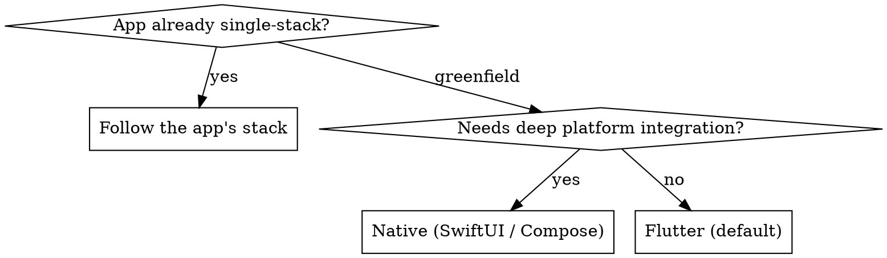

# Native vs Flutter Decision

## Overview

Flutter is the default for cross-platform mobile; native (SwiftUI / Jetpack Compose) is chosen when a task needs deep platform integration or the app is already native. Decide at the start — you cannot half-migrate an app mid-task.

**Core principle:** The existing app's stack wins by default. Only greenfield apps or the analiz task's direction open the choice.

## Decision

## Choose Flutter when

- Cross-platform (iOS + Android) from one codebase, standard UI + platform-channel-level device access.
- Greenfield app with no hard native requirement.
- The app is already Flutter — always.

## Choose native when

- The task needs platform capabilities Flutter exposes poorly: advanced widgets/animations tied to the OS, deep HealthKit/CarPlay/WidgetKit, App Clips, live activities, tight ARKit/CameraX use.
- The app is already native (SwiftUI for iOS, Compose for Android) — always follow it.
- The analiz task specifies native.

## Hard Rule

Never introduce a second UI stack into a single-stack app. A Flutter app that "needs one native screen" uses a platform view / channel — it does not gain a parallel SwiftUI module on your initiative. Flag genuine cross-stack needs in a task comment for the architect.

## Common Mistakes

- Picking your preferred stack over the app's.
- Reaching for native for something a Flutter plugin already does.
- Adding native modules to a Flutter app for a capability a platform channel covers.

## Red Flags

- Your choice has no reason beyond preference.
- You're scaffolding a new Xcode target inside a Flutter repo.
