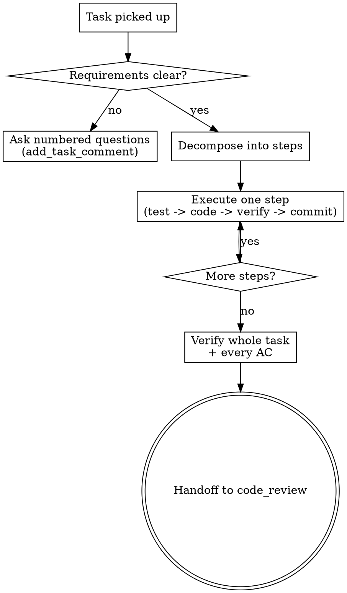

# Stepwise Task Execution

## Overview

An implementation task is never done in one big move. You understand the task completely, break it into an ordered list of small steps, and drive each step through its own test-and-commit cycle. This is the master workflow every developer role follows on every task; the individual disciplines it orchestrates live in their own skills.

**Core principle:** Small, verified, committed steps beat one large uncommitted change every time — for correctness, for review, and for cheap revisions.

**REQUIRED SUB-SKILLS:** tdd-workflow (each step is test-first), incremental-commits (commit each green step), verify-before-done (prove it works before handoff), root-cause-debugging (when a step or a revision fails).

## When to Use

Every task that changes product code — features, bug fixes, refactors, revisions. Never skip the decomposition because a task "looks small": unexamined small tasks are where scope and edge cases hide.



**Autonomy:** you do NOT wait for human approval on your plan. Understand, decompose, build, verify, and move the task to code_review yourself. The only human gate in the system is the system-architect's analiz review — implementation tasks are never gated on a human.

## The Process

### 1. Understand the task fully
- Read the description and EVERY acceptance criterion. Restate the outcome in your own words.
- Explore the code before changing it (codebase_search, grep_code, get_repo_tree): find the neighboring feature that already does something similar and follow its pattern. Never invent a parallel convention.
- List the exact files you expect to touch and the interfaces between them.
- Genuinely ambiguous requirement? add_task_comment with numbered questions. Never guess a product decision. A technical unknown you can answer by reading code is not a question — go read the code.

### 2. Decompose into steps
Write an ordered list of steps, each one action worth 2–5 minutes and ending in an independently verifiable state. A typical step is a TDD micro-cycle:

```
Step 1: failing test for empty-input validation
Step 2: watch it fail
Step 3: minimal code to pass
Step 4: run suite, green
Step 5: commit
```

Fold setup/scaffolding into the step whose deliverable needs it. Split only where each piece is worth its own commit.

### 3. Execute each step
Per step: write the failing test, watch it fail for the right reason, write the minimal code, run the suite green, then commit on your task branch. One logical change per commit. If a step balloons, stop, commit what is green, and re-slice the rest.

### 4. Verify the whole task
When all steps are done, run the full build and the affected test suite IN THIS RUN and read the output. Then walk every acceptance criterion line by line and confirm each is actually satisfied — tests passing is not the same as requirements met.

### 5. Handoff
The column move is NOT yours and is never a step in your plan: when your run ends with a green build and a real diff on the task branch, the control plane moves the task to code_review, opens the pull request (ready for review, never a draft) and starts the pipeline. A step whose only content is "move the task to code_review" is rejected before the plan runs.

Your closing action is your run's final message — what you changed and how you verified it. It is NOT a card comment: a run that finished its work behind a green build writes nothing on the task, because the diff, the PR, the pipeline result and the ticked criteria already say it. Comment only when something needs somebody: a question you cannot answer, work you did not do, a risk for the next person.

## Worked Example

Task: "Reject task titles longer than 200 chars with a 422." AC: (1) >200 chars → 422 + message; (2) ≤200 chars unaffected.

1. Explore: `grep_code "validate"` finds the existing title-required check in the create handler → follow that pattern.
2. Decompose: [test 422 for 201 chars] → [test 200 chars still passes] → [add bound check] → [verify + commit].
3. Step A: failing test posting a 201-char title expecting 422 → run, fails (currently 201 Created). Add the length guard next to the required check → run, green → commit `feat: reject task titles over 200 chars`.
4. Step B: test a 200-char title still returns 201 → already green (regression guard) → commit.
5. Verify: `go test ./internal/...` green; re-read AC1 and AC2 against the two tests — both covered.
6. Move to code_review with a How-to-test note: `curl` commands for a 201-char and a 200-char title with expected status codes.

## Common Mistakes

- Starting to code before listing the steps — you lose the thread and the diff bloats.
- One giant commit at the end — unreviewable, and a revision forces a rewrite instead of a tweak.
- Treating "tests pass" as "task done" without re-checking each AC.
- Asking the human to approve your step plan — implementation tasks are autonomous.
- Making board bookkeeping a step: claiming, moving columns and announcing progress take one tool call, produce nothing, and the hand-off move is the system's anyway.
- Re-reading code you have already read to be sure. Analysis you repeat is analysis you already have; the second pass costs a step and returns nothing.

## Red Flags — STOP

- You cannot describe your current uncommitted diff in one sentence → you missed a commit point.
- You are three steps deep with no test written → you dropped TDD.
- Your run is deep in and the diff is still empty → you are analysing, not building. Make the smallest real edit now.
- You are re-reading a file, re-running a grep or re-running a build over code you have not changed since it last passed → stop and decide.
- One of your steps is "move the task to code_review" → delete it; that move is made for you.
